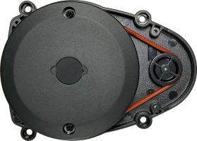

# ld08-Lidar-Arduino-Driver
This is a port of the ld08-driver (Sometimes referred to as LDS_02 by robotis with their turtlebots) for use with the arduino framework.

For more information about this lidar go to the site: "https://emanual.robotis.com/docs/en/platform/turtlebot3/appendix_lds_02/"

Good luck!
